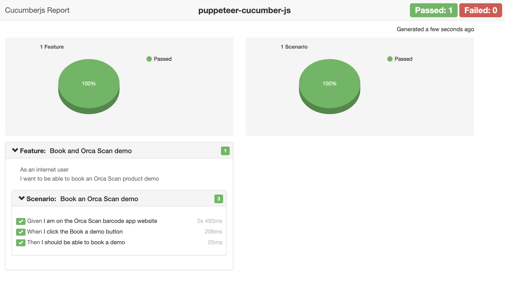

# [puppeteer-cucumber-js](https://github.com/john-doherty/selenium-cucumber-js)

[](https://github.com/orca-scan/puppeteer-cucumber-js/actions?query=workflow%3ABuild)
[](https://nodejs.org/en/)
[](https://opensource.org/licenses/ISC)
[](https://pptr.dev/)

Browser Automation framework using [puppeteer](https://github.com/puppeteer/puppeteer "view puppeteer documentation") and [cucumber-js](https://github.com/cucumber/cucumber-js "view cucumber js documentation").

Works with [Chrome](https://www.google.com/intl/en_uk/chrome/), [Firefox](https://www.mozilla.org/en-GB/firefox/new/), [Microsoft Edge](https://www.microsoft.com/en-us/edge) and [Brave](https://brave.com/download/).

**Table of Contents**

* [Installation](#installation)
* [Usage](#usage)
  * [Options](#options)
  * [Browser teardown strategy](#browser-teardown-strategy)
  * [Directory structure](#directory-structure)
  * [What are Feature files?](#what-are-feature-files)
  * [What are Step definitions?](#what-are-step-definitions)
  * [What are Page objects?](#what-are-page-objects)
  * [What are Shared objects?](#what-are-shared-objects)
  * [What are Helpers?](#what-are-helpers)
  * [Before/After hooks](#beforeafter-hooks)
  * [Reports](#reports)
  * [How to debug](#how-to-debug)
* [Demo](#demo)
* [Bugs](#bugs)
* [Contributing](#contributing)
* [License](#license)

## Installation

```bash
npm install puppeteer-cucumber-js
```

## Usage

```bash
node ./node_modules/puppeteer-cucumber-js/index.js # path to the module within your project
```

### Options

```bash
--tags <@tagname>               # cucumber @tag name to run
--featureFiles <path>           # comma-separated list of feature files or path to directory
--browser <name>                # browser to use (chrome, firefox, edge, brave). default chrome
--browserPath <path>            # optional path to a browser executable
--browser-teardown <optional>   # browser cleanup after each scenario (always, clear, none). default always
--headless                      # run browser in headless mode. defaults to false
--devTools                      # open dev tools with each page. default false
--noScreenshot                  # disable auto capturing of screenshots with errors
--disableLaunchReport           # disable auto opening the browser with test report
--timeOut <n>                   # steps definition timeout in milliseconds. defaults 10 seconds
--worldParameters <JSON>        # JSON object to pass to cucumber-js world constructor
--version                       # outputs puppeteer-cucumber-js version number
--help                          # list puppeteer-cucumber-js options
```

### Browser teardown strategy

The browser automatically closes after each scenario to ensure the next scenario uses a fresh browser environment. You can change this behavior using the `--browser-teardown` switch, options are:

Value      |  Description
---------- | ---------------
`always`   | the browser automatically closes (default)
`clear`    | the browser automatically clears cookies, local and session storages
`none`     | the browser does nothing

### Directory structure

Your files must live in a `features` folder within the root of your project:

```bash
.
└── features
    ├── google-search.feature
    └── step-definitions
    │   └── google-search-steps.js
    ├── page-objects
    │   └── google-search.js
    ├── shared-objects
    │   └── test-data.js
    └── reports                     # folder and content automatically created when tests run
        ├── cucumber-report.html
        ├── cucumber-report.json
        └── junit-report.xml
```

### What are Feature files?

A [Feature file](/features/google-search.feature) is a Business Readable file that lets you describe software behavior without detailing how that behavior is implemented. Feature files are written using the [Gherkin syntax](https://github.com/cucumber/cucumber/wiki/Gherkin).

```gherkin
Feature: Searching for a barcode scanner app
  
  Scenario: Google search for barcode scanner app
    Given I am online at google.co.uk
    When I search Google for "barcode scanner app"
    Then I should see "Orca Scan" in the results

  Scenario: Google search for Orca Scan
    Given I am online at google.co.uk
    When I search Google for "Orca Scan"
    Then I should see "Orca Scan" in the results
```

### What are Step definitions?

[Step definitions](features/step-definitions/google-search-steps.js) act as the glue between features files and the actual system under test. To avoid confusion **always** return a JavaScript promise from step definitions to let cucumber know when your task has completed.

```javascript
this.Given(/^I am online at google.co.uk/, function() {

    // use the ./page-objects/google-search.js url property
    return helpers.loadPage(pageObjects.googleSearch.url);
});

this.When(/^I search Google for "([^"]*)"$/, function (searchQuery) {

    // execute ./page-objects/google-search.js preformSearch method
    return pageObjects.googleSearch.preformSearch(searchQuery);
});

this.Then(/^I should see "([^"]*)" in the results$/, function (keywords) {

    // resolves if an item on the page contains text
    return helpers.waitForLinkText(keywords, false, 30);
});
```

The following variables are available within the ```Given()```, ```When()``` and ```Then()``` functions:

Variable      | Description
------------- | ------------------------------------------------------------------------------------------------------------------------------------------------------------------------------
`helpers`     | a collection of [helper methods](runtime/helpers.js) _things puppeteer does not provide but maybe should_
`puppeteer`   | the raw [puppeteer](https://github.com/puppeteer/puppeteer) object
`browser`     | instance of the puppeteer [browser](https://pptr.dev/#?product=Puppeteer&version=v5.5.0&show=api-class-browser) object
`page`        | instance of the puppeteer [page](https://pptr.dev/#?product=Puppeteer&version=v5.5.0&show=api-class-page) object
`pageObjects` | collection of page objects loaded from disk and keyed by filename
`shared`      | collection of **shared** objects loaded from disk and keyed by filename
`trace`       | handy trace method to log console output with increased visibility
`assert`      | instance of [chai assert](http://chaijs.com/api/assert/) to ```assert.isOk('everything', 'everything is ok')```
`expect`      | instance of [chai expect](http://chaijs.com/api/bdd/) to ```expect('something').to.equal('something')```

### What are Page objects?

[Page objects](/features/page-objects/google-search.js) allow you to define information about a specific page in one place such as selector, methods etc.
These objects are accessible from within your step definition files and help to reduce code duplication. Should your page change, you can fix your tests by modifying the selectors in one location.

You can access page object properties and methods via a global ```pageObject``` variable. Page objects are loaded from ```./features/page-objects``` folder and are exposed as a camel-cased version of their filename, for example ```./page-objects/google-search.js``` becomes ```pageObjects.googleSearch```. You can also use subdirectories, for example ```./page-objects/dir/google-search.js``` becomes ```pageObjects.dir.googleSearch```.

Page objects also have access to the same runtime variables available to step definitions.

An example page object:

```javascript
module.exports = {

    url: 'http://www.google.co.uk',

    selectors: {
        searchInput: '[name="q"]',
        searchResultLink: 'a > h3 > span',
        cookieIFrame: 'iframe[src*="consent.google.com"]',
        cookieAgreeButton: '#introAgreeButton > span > span'
    },

    /**
     * enters a search term into Google's search box and presses enter
     * @param {string} searchQuery - phrase to search google with
     * @returns {Promise} a promise to enter the search values
     */
    preformSearch: async function (searchQuery) {

        // get the selector above (pageObjects.googleSearch is this object)
        var selector = pageObjects.googleSearch.selectors.searchInput;

        // accept Googles `Before you continue` cookie dialog
        await helpers.clickElementWithinFrame(pageObjects.googleSearch.selectors.cookieIFrame, pageObjects.googleSearch.selectors.cookieAgreeButton);

        // set focus to the search box
        await page.focus(selector);

        // enter the search query
        await page.keyboard.type(searchQuery, { delay: 100 });

        // press enter
        return page.keyboard.press('Enter');
    }
};
```

### What are Shared objects?

[Shared objects](/features/shared-objects/test-data.js) allow you to share anything from test data to helper methods throughout your project via a global ```sharedObjects``` object. Shared objects are automatically loaded from ```./features/shared-objects/``` and made available via a camel-cased version of their filename, for example ```./features/shared-objects/test-data.js``` becomes ```sharedObjects.testData```. You can also use subdirectories, for example ```./features/shared-objects/dir/test-data.js``` becomes ```sharedObjects.dir.testData```.

Shared objects also have access to the same runtime variables available to step definitions.

An example shared object:

```javascript
module.exports = {
    username: "import-test-user",
    password: "import-test-pa**word"
}
```

And its usage within a step definition:

```js
module.exports = function () {

    this.Given(/^I am logged in"$/, function () {

        // set focus to username
        await page.focus('#username');

        // type username
        await page.keyboard.type(sharedObjects.testData.username);

        // set focus to password
        await page.focus('#password');

        // type password
        await page.keyboard.type(sharedObjects.testData.password);

        // press enter (submit form)
        return page.keyboard.press('Enter');
    });
};
```

### What are Helpers?

[Helpers](/runtime/helpers.js) are globally defined helper methods that simplify working with puppeteer:

```js
// Load a URL, returning only when all network activity has finished
helpers.loadPage('http://www.google.com');

// Removes an element from the dom
helpers.removeElement('p > span');

// Waits for text to appear on the page
helpers.waitForLinkText('Orca Scan', false, 30);

// Waits for the browser to fire an event (including custom events)
helpers.waitForEvent('app-ready');

// Gets an element within an iframe
helpers.getElementWithinFrame('iframe[src*="consent.google.com"]', '#introAgreeButton > span > span');

// Clicks an element within an iframe
helpers.clickElementWithinFrame('iframe[src*="consent.google.com"]', '#introAgreeButton > span > span');

// Removes all browser cookies
helpers.clearCookies();

// Clears localStorage
helpers.clearLocalStorage();

// Clears sessionStorage
helpers.clearSessionStorage();

// Clears cookies and storage
helpers.clearCookiesAndStorages();

// Stop the browser in debug mode (must have DevTools open)
helpers.debug()
```

### Before/After hooks

You can register before and after handlers for features and scenarios:

| Event          | Example
| -------------- | ------------------------------------------------------------
| BeforeFeature  | ```this.BeforeFeatures(function(feature, callback) {})```
| AfterFeature   | ```this.AfterFeature(function(feature, callback) {});```
| BeforeScenario | ```this.BeforeScenario(function(scenario, callback) {});```
| AfterScenario  | ```this.AfterScenario(function(scenario, callback) {});```

```js
module.exports = function () {

    // add a before feature hook
    this.BeforeFeature(function(feature, done) {
        console.log('BeforeFeature: ' + feature.getName());
        done();
    });

    // add an after feature hook
    this.AfterFeature(function(feature, done) {
        console.log('AfterFeature: ' + feature.getName());
        done();
    });

    // add before scenario hook
    this.BeforeScenario(function(scenario, done) {
        console.log('BeforeScenario: ' + scenario.getName());
        done();
    });

    // add after scenario hook
    this.AfterScenario(function(scenario, done) {
        console.log('AfterScenario: ' + scenario.getName());
        done();
    });
};
```

### Reports

HTML, JSON and JUnit reports are auto generated with each test run and stored in `./features/reports/`:



### How to debug

To step into debug mode in the browser, enable dev tools `--devTools` and use `helpers.debug()` within your steps:

```js
module.exports = function () {

    this.When(/^I search Google for "([^"]*)"$/, async function (searchQuery, done) {

        // Stop the browser in debug mode
        helpers.debug();
    });
};
```

## Demo

To demo the framework without installing in your project use the following commands:

```bash
# download this example code
git clone https://github.com/orca-scan/puppeteer-cucumber-js.git

# go into the new directory
cd puppeteer-cucumber-js

# install dependencies
npm install

# run the google search feature
node index
```

## Bugs

Please provide as much info as possible _(ideally a code snippet)_ when [raising a bug](https://github.com/orca-scan/puppeteer-cucumber-js/issues)

## Contributing

PRs welcome 🤓

## License

Licensed under [ISC License](LICENSE) &copy; Orca Scan - [Barcode Tracking, Simplified.](https://orcascan.com)
